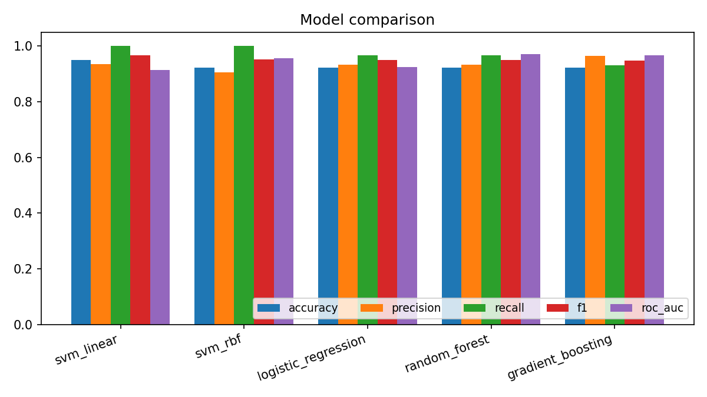
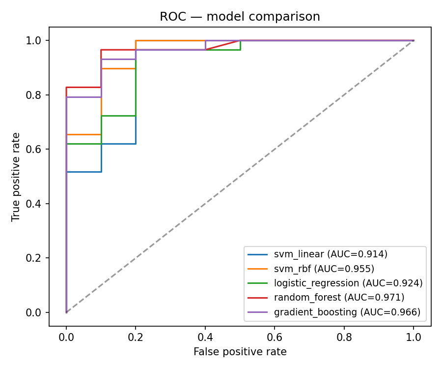
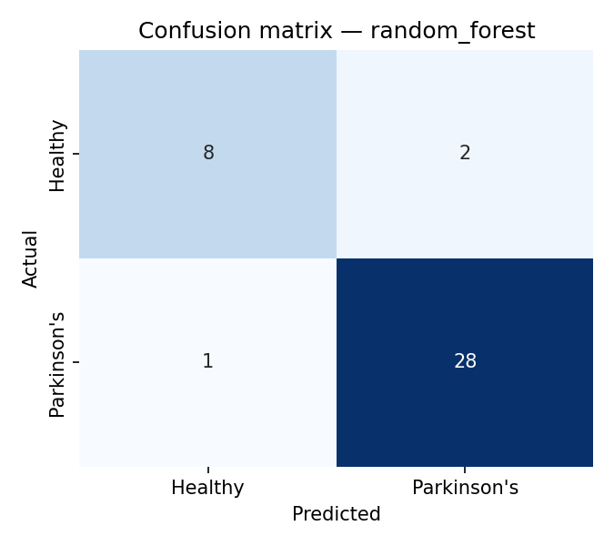

# Parkinson's Disease Detection — SVM + 4 Baselines

[](https://www.python.org/)
[](https://scikit-learn.org/)
[](https://streamlit.io/)
[](LICENSE)

Predict Parkinson's disease from **22 voice biomarkers** — jitter, shimmer, fundamental frequency,
noise-to-harmonics, nonlinear dynamics — using a classical-ML pipeline trained on the UCI
Parkinson's dataset.

Built as a portfolio refresh of a college project (May 2023), upgraded with modular code, a
multi-model comparison, a polished Streamlit demo, and an explainability tab.

> **⚠️ Not a medical device.** This is a research/portfolio demonstration. Predictions are a
> screening signal only, never a diagnosis.

---

## 🎯 Results

Held-out test set: **39 samples** (stratified 80/20 split, seed 42).

| Model | Accuracy | Precision | Recall | F1 | ROC-AUC |
|---|---:|---:|---:|---:|---:|
| **SVM (linear)** | **0.9487** | 0.9355 | **1.0000** | **0.9667** | 0.9138 |
| SVM (RBF) | 0.9231 | 0.9063 | 1.0000 | 0.9508 | 0.9552 |
| Logistic Regression | 0.9231 | 0.9333 | 0.9655 | 0.9492 | 0.9241 |
| **Random Forest** | 0.9231 | 0.9333 | 0.9655 | 0.9492 | **0.9707** |
| Gradient Boosting | 0.9231 | 0.9643 | 0.9310 | 0.9474 | 0.9655 |

- **SVM (linear)** wins by accuracy and F1 — matching the original college project's headline model.
- **Random Forest** edges out SVM by ROC-AUC and is shipped as the default in `models/best_model.joblib`.



| ROC curves | Confusion matrix (Random Forest) |
|---|---|
|  |  |

---

## 🖥️ Demo

The Streamlit app exposes the full pipeline interactively:

- **🔬 Prediction** tab — adjust biomarkers (or load a healthy/Parkinson's preset), get probability + class confidence + gauge.
- **🧠 Explainability** tab — see which features deviate most from the dataset mean (z-score view).
- **📊 Model performance** tab — full metrics table + ROC + confusion matrices.
- **📖 About** tab — methodology, limitations, citations.

Launch locally with:

```bash
streamlit run app/streamlit_app.py
```

Custom theme via `app/.streamlit/config.toml` + injected CSS in `app/assets/style.css` (no default Streamlit chrome).

---

## 🚀 Run locally

Each project ships with a one-shot setup that creates an **isolated `.venv`**:

```bash
git clone https://github.com/MatamDinesh0802/Parkinsons-Disease-Detection-SVM.git
cd Parkinsons-Disease-Detection-SVM

bash setup.sh                          # create .venv and install deps
source .venv/bin/activate

python -m src.parkinsons.train         # train all 5 models, save metrics + figures
python -m src.parkinsons.evaluate      # print the metrics table
streamlit run app/streamlit_app.py     # launch the demo
```

Sign in to the Streamlit demo with **Username: `Admin`** · **Password: `Admin@123`** (static demo credentials).

### Reproduce via Colab notebook

For an EDA-first walkthrough, open [`notebooks/01_train_parkinsons.ipynb`](notebooks/01_train_parkinsons.ipynb)
in Google Colab. It loads the UCI dataset directly, runs EDA (correlation heatmap, class balance),
trains all 5 models, and exports the same artifacts (`best_model.joblib`, `scaler.joblib`,
`metrics.json`, ROC + confusion-matrix figures). Drop them into `models/` and `reports/`.

Run tests:

```bash
pip install pytest
pytest -v
```

---

## 🧪 Methodology

1. **Data**: UCI Parkinson's dataset — 195 voice recordings from 31 subjects, 22 features. Class balance ≈ 75% Parkinson's / 25% healthy.
2. **Pipeline**: stratified 80/20 split → `StandardScaler` (fit on train only) → classifier.
3. **Models trained**: SVM (linear & RBF), Logistic Regression, Random Forest, Gradient Boosting.
4. **Selection**: best model is chosen by held-out ROC-AUC and serialised to `models/best_model.joblib`.
5. **Inference**: `src/parkinsons/predict.py::ParkinsonsPredictor` loads model + scaler once and predicts on dict / array input.

See [`data/README.md`](data/README.md) for the full feature glossary.

---

## 🗂️ Project structure

```
Parkinsons-Disease-Detection-SVM/
├── app/                        # Streamlit demo
│   ├── streamlit_app.py        # main UI
│   ├── .streamlit/config.toml  # custom theme
│   └── assets/style.css        # injected CSS
├── data/
│   ├── raw/parkinsons.csv      # UCI Parkinson's dataset (195 rows)
│   └── README.md               # dataset + feature glossary
├── notebooks/                  # exploratory analysis (optional)
├── reports/
│   ├── figures/                # ROC curves, confusion matrices, model comparison
│   ├── metrics.json            # canonical results
│   └── original_report.pdf     # original college project report (preserved)
├── src/parkinsons/             # modular Python package
│   ├── config.py               # paths, constants, feature list
│   ├── data.py                 # load + split + scale
│   ├── model.py                # 5 model definitions
│   ├── train.py                # CLI training entrypoint
│   ├── evaluate.py             # CLI metrics dump
│   └── predict.py              # single-sample inference (used by app)
├── tests/                      # pytest smoke tests
├── models/                     # trained artifacts (gitignored)
├── requirements.txt
├── setup.sh                    # one-shot venv + install
└── LICENSE
```

---

## ⚠️ Limitations

- The dataset is small (195 rows, 31 subjects) — generalization to other recording conditions is unverified.
- A subject can appear in both train and test splits because we split by row, not by subject. A real clinical study would split by subject.
- Voice features depend on microphone, language, accent, and recording protocol. Predictions on out-of-distribution audio are unreliable.
- The class imbalance (75/25) means accuracy can be misleading — F1 and ROC-AUC are the better signals here.

---

## 📚 Citation

```bibtex
@article{little2007exploiting,
  title={Exploiting nonlinear recurrence and fractal scaling properties for voice disorder detection},
  author={Little, Max A and McSharry, Patrick E and Roberts, Stephen J and Costello, Declan A and Moroz, Irene M},
  journal={BioMedical Engineering OnLine},
  volume={6},
  number={1},
  pages={1--19},
  year={2007},
  publisher={Springer}
}
```

---

## 👤 Author

**Matam Dinesh Chandra** — [GitHub](https://github.com/MatamDinesh0802) · [Email](mailto:matamdinesh0802@gmail.com)
